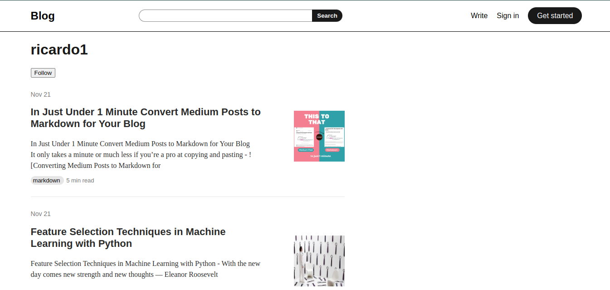

# Blog app
A blogging website inspired on Medium made with Django  

## Installation
Follow the steps bellow to install the project

 

Clone the repository using **git**:
~~~shell
git clone https://github.com/rcorrei4/blog-app
~~~

Go to the folder:
~~~shell
cd LibriumSwap
~~~
Install all necessary dependencies to run the project:
~~~shell
pip3 install -r requirements.txt
~~~

Migrate django database:
~~~shell
python3 manage.py makemigrations
~~~
~~~shell
python3 manage.py migrate
~~~

## Run the project

Enter the following command:
~~~shell
python3 manage.py runserver
~~~

## Testing
~~~shell
python3 manage.py test
~~~

 

For accessing the website enter the following url on your browser:
`127.0.0.1:8000`
####  Todo
- [x] Change like view and save view method to POST
- [ ] Test views
- [x] Change article views to be based on IP visits
- [X] Logged-in index page
- [ ] Recommendation System
- [ ] Better article writing
- [ ] Responsive design